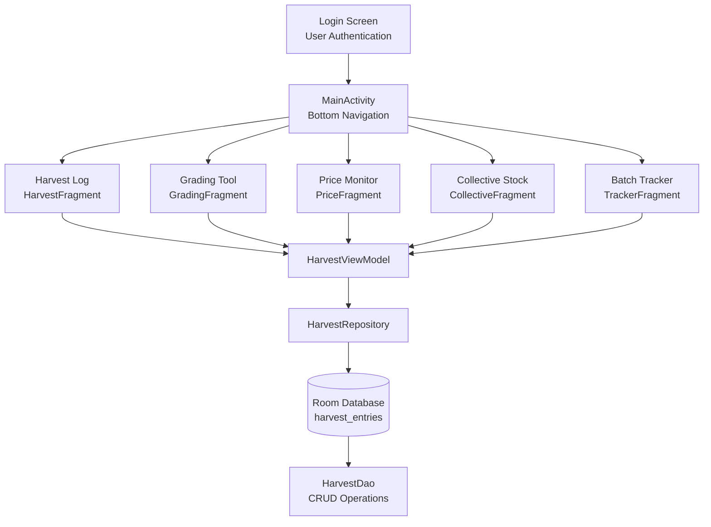
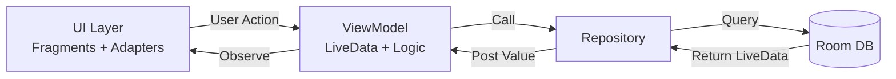
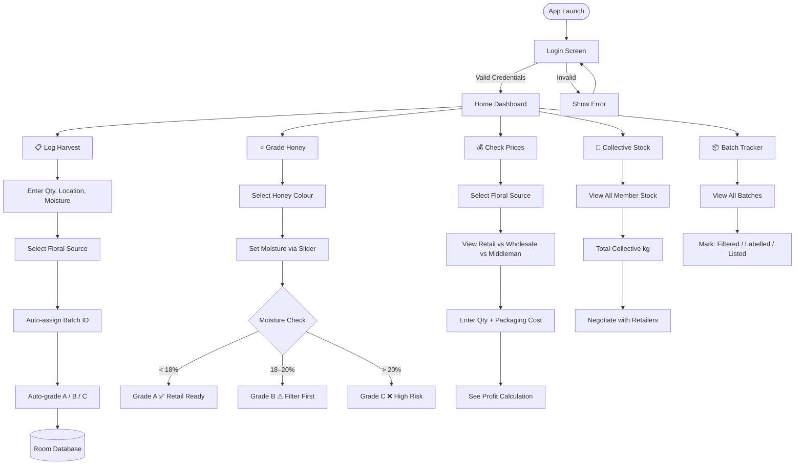
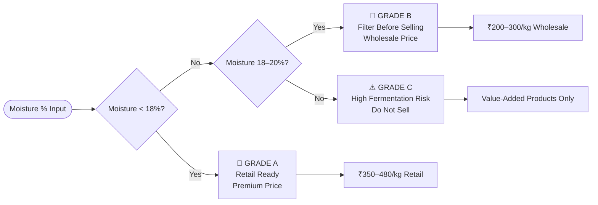
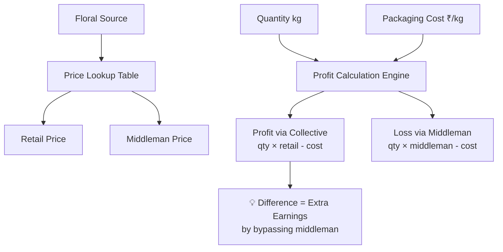
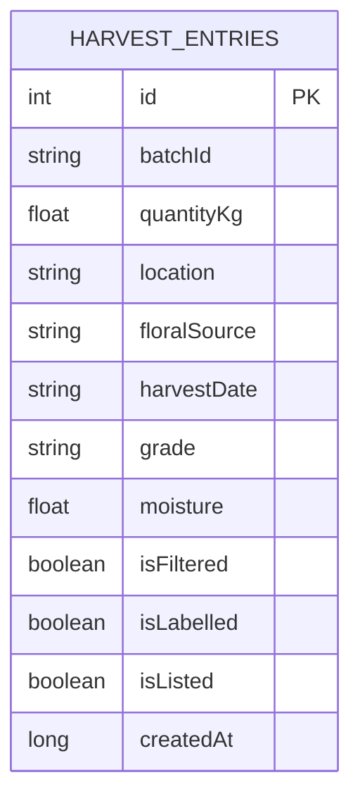

<div align="center">

# 🍯 ಜೇನು ಗುಂಪು — Jenu Gumpu
### Honey Producer's Collective App

<p align="center">
  
  
  
  
  
  
</p>

<p align="center">
  <b>Empowering tribal honey hunters of Karnataka to become brands — not just suppliers.</b><br/>
  A GenAI-assisted Android app that helps rural honey producers grade, track, price, and collectively negotiate their honey harvest.
</p>

</div>

---

## 📌 The Problem

> Tribal and rural honey hunters in districts like Hassan, Chikmagalur, and Sakleshpur sell raw honey to middlemen at **₹100–120/kg** — while the same honey retails in Bengaluru for **₹350–480/kg**.

They lack:
- Knowledge of honey grading (moisture, colour, purity)
- Access to retail price data
- Tools to track batches and negotiate collectively
- A platform to form producer groups

**Jenu Gumpu solves all of this — offline, in Kannada, on any Android phone.**

---

## 🏗️ Architecture

### High-Level App Architecture



### MVVM Data Flow



---

## 🔄 App User Flow



---

## 🍯 Honey Grading Algorithm



---

## 💰 Profit Calculator Logic



---

## ✨ Core Features

### 🔐 Login Screen
- Secure entry point with username & password authentication
- Clean Material UI with the Jenu Gumpu branding
- Session management to keep users logged in

### 📋 Harvest Log
- Record **date, location, quantity (kg), moisture %** and **floral source**
- Floral sources: Coffee Blossom, Wildflower, Jamun, Eucalyptus, Neem
- **Auto Batch ID** generated on every entry (e.g. `BATCH-001`)
- **Auto Grading** — Grade A/B/C assigned based on moisture %
- All data persisted locally using **Room Database**

### ⭐ Grading Tool
- **Visual Colour Guide** — Golden, Amber, Dark Brown with descriptions
- **Interactive Moisture Slider** — drag to your refractometer reading
- **Real-time Grade Result** with actionable advice
- Grading Key card for quick reference

### 💰 Price Monitor + Profit Calculator
- Real-time retail vs wholesale vs middleman price comparison
- Price data for 5 floral varieties
- **Profit Calculator** — enter your qty and packaging cost to see exact earnings
- Shows how much more you earn by **bypassing the middleman**

### 👥 Collective Stock
- Aggregates stock from all group members
- Shows **total collective kg** — a key negotiation tool with retailers
- Member-wise breakdown with location

### 📦 Batch Tracker
- Lists all logged batches with full details
- Checkbox-based status tracking: **Filtered → Labelled → Listed**
- Traceability from forest to retail shelf

---

## 🗄️ Database Schema



---

## 🚀 Running Locally — Step by Step

### Prerequisites
- [Android Studio Hedgehog 2023.1.1+](https://developer.android.com/studio)
- JDK 17
- Android device or emulator running **Android 7.0 (API 24)+**

### Step 1 — Clone the Repository
```bash
git clone https://github.com/YOUR_USERNAME/JenuGumpu.git
```

### Step 2 — Open in Android Studio
1. Open **Android Studio** → **File → Open**
2. Select the `JenuGumpu` folder
3. Wait for Gradle sync to complete

### Step 3 — Configure gradle.properties
Make sure the file `gradle.properties` at the root contains:
```properties
android.useAndroidX=true
android.enableJetifier=true
```

### Step 4 — Build and Run
1. Connect your Android device via USB and enable **USB Debugging**
   - OR create an emulator: **Pixel 4a, API 30, x86**
2. Click **▶ Run** or press `Shift + F10`
3. Grant any requested permissions

---

## 📁 Project Structure

```
JenuGumpu/
├── app/src/main/
│   ├── java/com/jenugumpu/
│   │   ├── ui/
│   │   │   ├── MainActivity.java
│   │   │   ├── harvest/
│   │   │   │   ├── HarvestFragment.java
│   │   │   │   ├── HarvestViewModel.java
│   │   │   │   └── HarvestAdapter.java
│   │   │   ├── grading/
│   │   │   │   └── GradingFragment.java
│   │   │   ├── price/
│   │   │   │   └── PriceFragment.java
│   │   │   ├── collective/
│   │   │   │   └── CollectiveFragment.java
│   │   │   └── tracker/
│   │   │       ├── TrackerFragment.java
│   │   │       └── TrackerAdapter.java
│   │   └── data/
│   │       ├── model/
│   │       │   └── HarvestEntry.java
│   │       ├── db/
│   │       │   ├── AppDatabase.java
│   │       │   └── HarvestDao.java
│   │       └── repository/
│   │           └── HarvestRepository.java
│   └── res/
│       ├── layout/          # All XML layouts
│       ├── drawable/        # Custom shapes & icons
│       ├── values/          # Colors, strings, themes
│       └── menu/            # Bottom navigation menu
```

---

## 🎯 Impact Goals

| Goal | Description |
|------|-------------|
| 🌿 **Tribal Empowerment** | Improving livelihoods of forest-dwelling communities in Hassan & Chikmagalur districts |
| 🍃 **Organic Growth** | Promoting "Forest-to-Table" chemical-free products |
| 🐝 **Sustainable Harvest** | Guidelines on harvesting honey without killing the bee colony |
| 💸 **Fair Pricing** | Helping producers earn 3–4× more by bypassing middlemen |

---

## 🛠️ Tech Stack

| Layer | Technology |
|-------|------------|
| Language | Java |
| UI | XML Layouts + Material Components |
| Architecture | MVVM (ViewModel + LiveData) |
| Database | Room (SQLite) |
| Navigation | Fragment + BottomNavigationView |
| Build | Gradle 8.x + AGP |
| Min SDK | Android 7.0 (API 24) |
| Target SDK | Android 14 (API 34) |

---

## 📜 License

This project was developed as part of the **MindMatrix VTU Internship Program**.

---

<div align="center">
  <b>Built with ❤️ for the honey hunters of Karnataka</b><br/>
  <i>"From the forest floor to the retail shelf — with dignity and fair price."</i>
</div>
