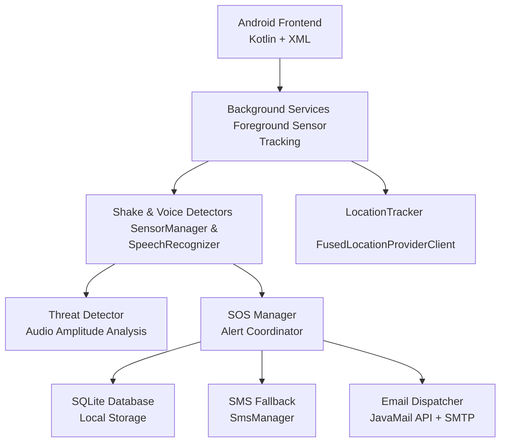
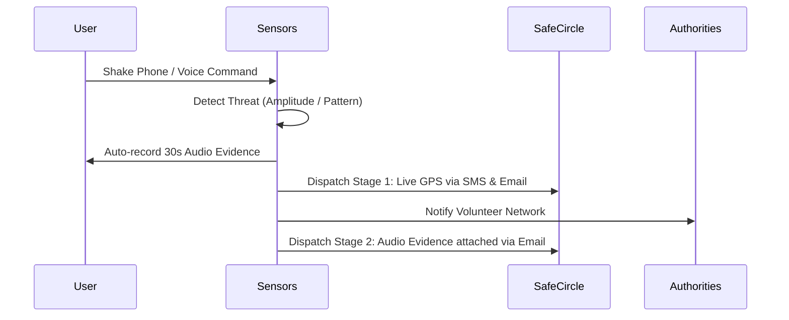

<div align="center">

# 🛡️ Suraksha-Setu — Hyper-Local Safety Network

<p align="center">
  
  
  
  
  
</p>

A hyper-local emergency safety application designed to protect women and the elderly by immediately alerting a local "Circle of Trust" (neighbors, shopkeepers, volunteers) and local authorities within a 5-kilometer radius during critical situations.

</div>

---

## 🏗️ Architecture

### High-Level Architecture



### Emergency Alert Workflow



---

## ✨ Core Features

### 🚨 Rapid SOS Dispatch
- **Hardware Trigger:** Shake the phone continuously to trigger an SOS, even if the app is closed or running in the background.
- **Voice Trigger:** Speak a predefined safe word or scream to activate the alarm.
- **AI Threat Detection:** Analyzes microphone amplitude to automatically detect panic/screaming.

### 👥 Safe Circle Management
- Add up to 5 trusted contacts (family, neighbors, local shopkeepers).
- Explicit, user-friendly UI for managing and deleting contacts.
- Immediate notification to all contacts via **SMS Fallback** and **Encrypted SMTP Emails**.

### 🕵️ Evidence Collection
- **Two-Stage SOS:** Instantly sends out live GPS coordinates to ensure rapid response.
- **Audio Capture:** Silently records 30 seconds of background audio during the emergency and emails it as an encrypted `.mp3` attachment to the Safe Circle.

### 🚓 Live Authority Tracking
- **Nearby Police:** Integrates completely free **OpenStreetMap Overpass API** to instantly locate all police stations within a 5km radius.
- **Interactive UI:** Tap a police station to instantly map directions via Google Maps.
- **One-Tap Dial:** Instantly dial National Emergency Number (112).

### ⚙️ Customizable Settings
- Toggle background Shake Detection to save battery.
- Toggle continuous Voice Command monitoring.
- Dark-mode optimized high-visibility UI with a massive SOS panic button.

---

## 🖼️ Application Screenshots

<div align="center">
  <table>
    <tr>
      <td align="center" valign="top"><br/><b>Home Screen</b></td>
      <td align="center" valign="top"><br/><b>Safe Circle</b></td>
      <td align="center" valign="top"><br/><b>Alert History</b></td>
    </tr>
    <tr>
      <td align="center" valign="top"><br/><b>Live Police Maps</b></td>
      <td align="center" valign="top"><br/><b>Settings</b></td>
      <td align="center" valign="top"></td> <!-- Empty cell for alignment -->
    </tr>
  </table>
</div>

---

## 🚀 Running Locally — Step by Step

### Prerequisites
- [Android Studio Iguana+](https://developer.android.com/studio)
- [Java Development Kit (JDK) 17](https://www.oracle.com/java/technologies/javase/jdk17-archive-downloads.html)
- A physical Android Device or Emulator running Android 9.0+

### Step 1 — Clone the Repository
```bash
git clone https://github.com/Abhinek8987/Suraksha-Setu.git
```

### Step 2 — Configure Email Credentials
This app uses direct SMTP to send emails. You must configure your Google App Password.
1. Open `app/src/main/java/com/example/surakshasetu/email/EmailSender.kt`
2. Update the credentials on line 20:
```kotlin
val username = "YOUR_GMAIL@gmail.com"
val password = "YOUR_16_DIGIT_APP_PASSWORD"
```

### Step 3 — Build and Run
1. Open the project folder in **Android Studio**.
2. Allow Gradle to sync.
3. Connect your Android device via USB (enable USB Debugging) or start an Emulator.
4. Click **Run** (`Shift + F10`).
5. **Critical:** Grant all requested permissions (Location, Microphone, SMS) for the background services to function correctly!

---

*Designed and Built for the safety of rural communities and the women workforce.*
